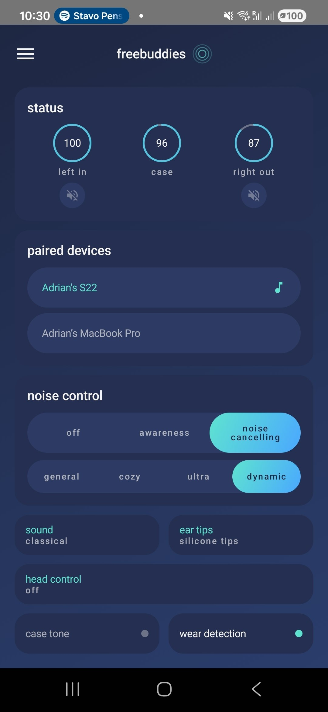
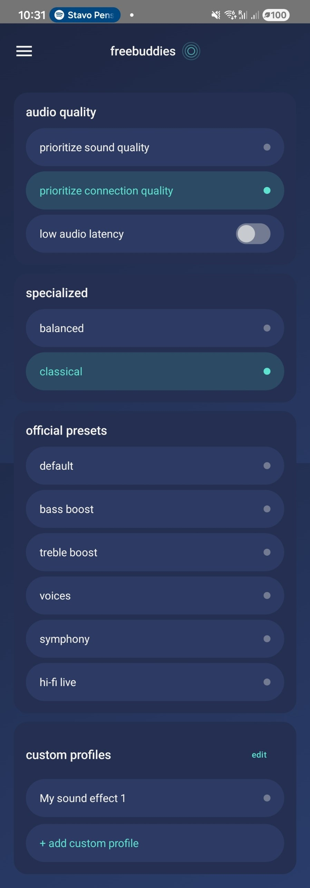
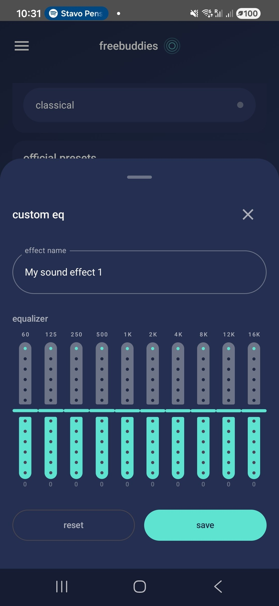
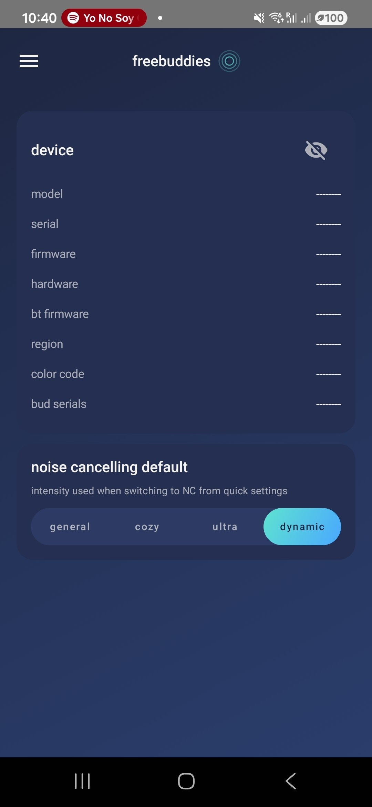
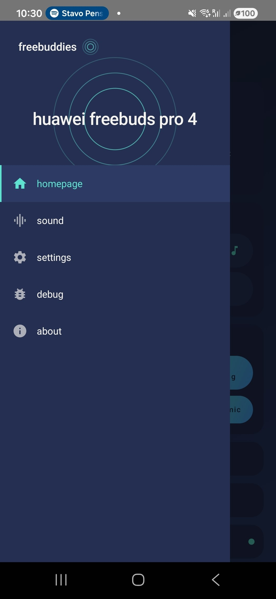
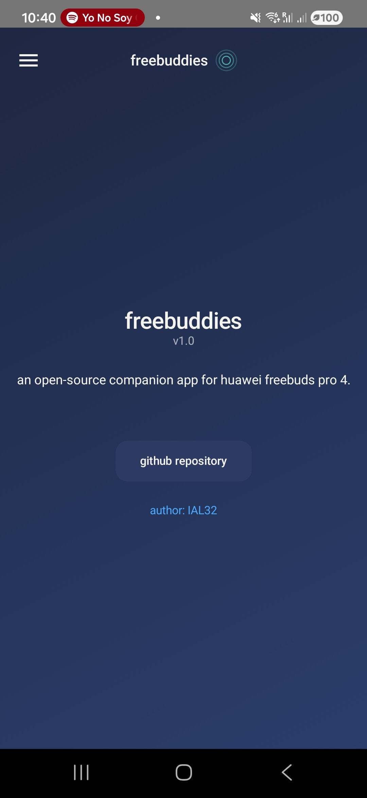

# FreeBuddies

An open-source Android companion app for the **Huawei FreeBuds 4 Pro** (`T0022` / `T0022C`). FreeBuddies communicates with the earbuds over Bluetooth SPP using a reverse-engineered protocol, providing battery monitoring, noise control, and earbud-locating features — without requiring Huawei's AI Life app.

## Features

- **Battery status** — real-time percentage and charging state for left bud, right bud, and case
- **In-ear detection** — three-state wear detection per bud (in-ear, out, in-case)
- **ANC / Awareness control** — switch between Off, Noise Cancellation (General / Cozy / Ultra / Dynamic), and Awareness (Normal / Voice) modes
- **Sound configuration** — EQ presets (Default, Balanced, Classical, Bass Boost, Treble Boost, Voices, Symphony, Hi-Fi Live), custom EQ profiles with 10-band editor and live preview
- **Audio quality** — prioritize sound quality or connection quality, low audio latency toggle
- **Ear tips** — switch between silicone and memory foam tip profiles
- **Find My Buds** — ring either earbud independently to locate it
- **Paired devices** — shows connected devices and current playback state
- **Charging case tone** — toggle case tone (requires both buds in case)
- **Smart wear detection** — toggle proximity sensor on/off
- **Head control** — enable/disable head gestures, configure nod and shake actions (answer call, reject call, none)
- **Device info** — model, serial number, firmware (full build string), hardware revision, BT chip, BT firmware ID, region, color code, individual bud serials. Privacy toggle hides sensitive values by default
- **Quick Settings tiles** — Android Quick Settings tiles for ANC cycling and Find My Buds
- **Debug log** — real-time protocol log with copy-to-clipboard and save-to-file

## Screenshots

| Main | Sound | Equalizer |
|------|-------|-----------|
|  |  |  |

| Settings | Sidebar | About |
|----------|---------|-------|
|  |  |  |

## Requirements

- Android 7.0+ (API 24)
- Huawei FreeBuds 4 Pro, already paired via system Bluetooth settings
- JDK 21 (for building)

## Building

Clone the repository and build with Gradle:

```bash
git clone git@github.com:IAL32/freebuddies.git
cd freebuddies
```

### Debug build

```bash
./gradlew assembleDebug
```

The APK is written to `app/build/outputs/apk/debug/app-debug.apk`.

### Release build

```bash
./gradlew assembleRelease
```

The APK is written to `app/build/outputs/apk/release/app-release-unsigned.apk`.

## Installing via ADB

Connect a device or start an emulator, then install the debug APK:

```bash
adb install app/build/outputs/apk/debug/app-debug.apk
```

To build and install in one step:

```bash
./gradlew installDebug
```

## Running

Launch the app from the device's app drawer, or via ADB:

```bash
adb shell am start -n com.freebuddies.app/.MainActivity
```

On first launch the app requests Bluetooth permissions. Once granted, it automatically scans paired devices for the FreeBuds 4 Pro and connects over SPP.

## Project structure

```
freebuddies/
├── app/
│   ├── README.md                        # SPP protocol reference
│   └── src/main/java/com/freebuddies/app/
│       ├── MainActivity.kt              # Entry point, permission handling
│       ├── FreebuddiesApplication.kt    # Application subclass
│       ├── FreeBudsViewModel.kt         # UI state facade
│       ├── FreeBudsConnectionManager.kt # Bluetooth lifecycle singleton
│       ├── bluetooth/
│       │   └── FreeBudsManager.kt       # SPP socket, frame routing, state flows
│       ├── protocol/
│       │   ├── Protocol.kt              # CRC16, TLV parsing, frame building
│       │   └── Models.kt                # Data classes for protocol messages
│       ├── ui/
│       │   ├── FreebuddiesApp.kt        # Root composable with navigation
│       │   ├── screens/                  # Home, Sound, Settings, Debug, About
│       │   ├── components/              # Reusable Compose components
│       │   └── theme/                   # Material3 theme, colors, dimensions
│       └── tile/
│           ├── AncTileService.kt        # Quick Settings tile for ANC
│           └── FindBudsTileService.kt   # Quick Settings tile for Find My Buds
├── analysis/                            # Protocol analysis tools (Python)
│   ├── README.md                        # Tool documentation and workflow guide
│   ├── parse_btsnoop.py                 # Parse btsnoop HCI binary logs
│   ├── decode_session.py                # Parse Wireshark text exports
│   └── decode_inline.py                 # Decode extracted SPP frames
└── gradle/                              # Gradle wrapper (9.4.1)
```

## Tech stack

- **Language:** Kotlin
- **UI:** Jetpack Compose with Material3
- **Architecture:** MVVM with `StateFlow`
- **Bluetooth:** RFCOMM / SPP via Android Bluetooth APIs
- **Build:** Gradle 9.4.1, AGP 9.2.0

## Protocol documentation

The full reverse-engineered SPP protocol reference — including frame format, TLV encoding, CRC algorithm, and a complete command reference — lives in [`app/README.md`](app/README.md).

## Contributing

1. Fork the repository
2. Create a feature branch (`git checkout -b my-feature`)
3. Make changes and verify they compile (`./gradlew assembleDebug`)
4. Commit with a clear message describing what changed and why
5. Push to your fork and open a pull request against `main`

### Areas where contributions are especially welcome

- **Protocol research** — many commands are still undocumented (see the "Known unknowns" section in `app/README.md`). Wireshark captures from AI Life sessions are valuable.
- **Support for other FreeBuds models** — the protocol is similar across the FreeBuds family. Adapting the app to additional models requires captures and testing.
- **UI/UX improvements** — the interface is functional but minimal.
- **Tests** — unit tests for protocol parsing and frame building.

## Acknowledgments

- [MelianMiko](https://mmk.pw/en/posts/freebuds-4i-proto/) — FreeBuds 4i protocol documentation
- [TheLastGimbus / FreeBuddy](https://github.com/TheLastGimbus/FreeBuddy) — CRC16-XModem identification and mbb-protocol notes
- [Gadgetbridge](https://codeberg.org/Freeyourgadget/Gadgetbridge/issues/4241) — FreeBuds 5i frame structure confirmation
- [OpenFreebuds](https://github.com/melianmiko/OpenFreebuds) — open-source reference implementation for related devices
